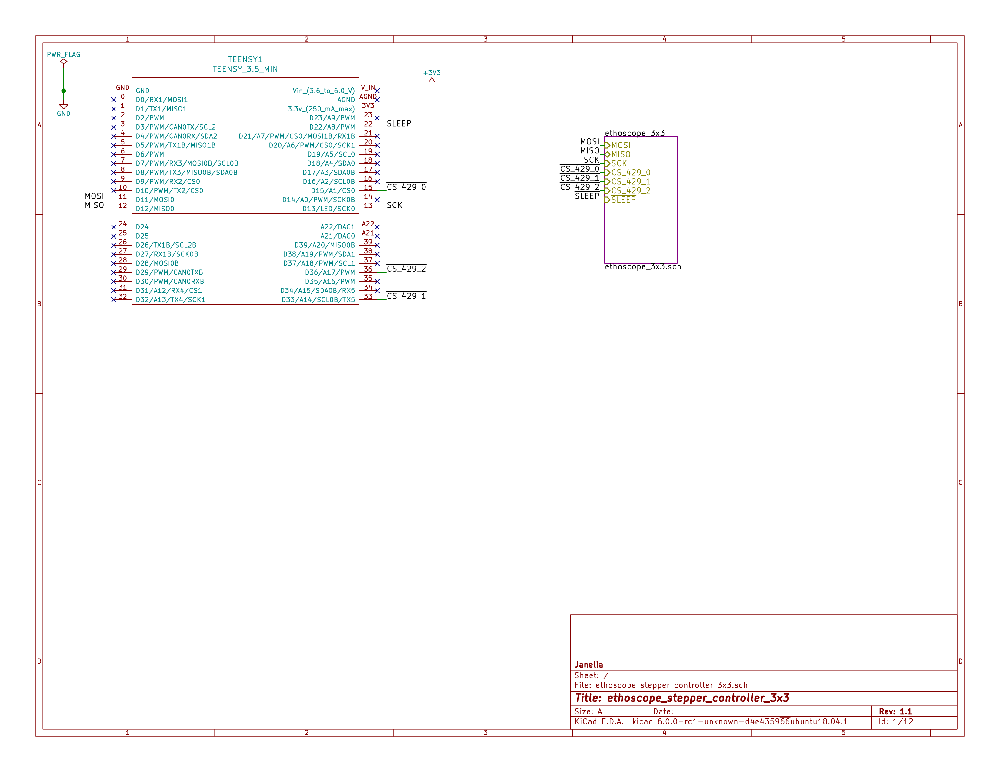
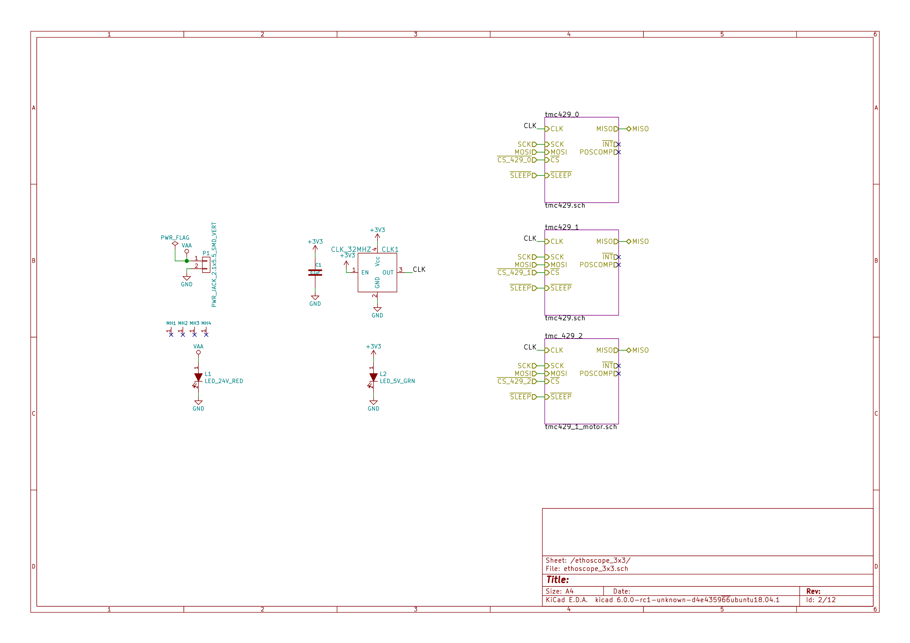
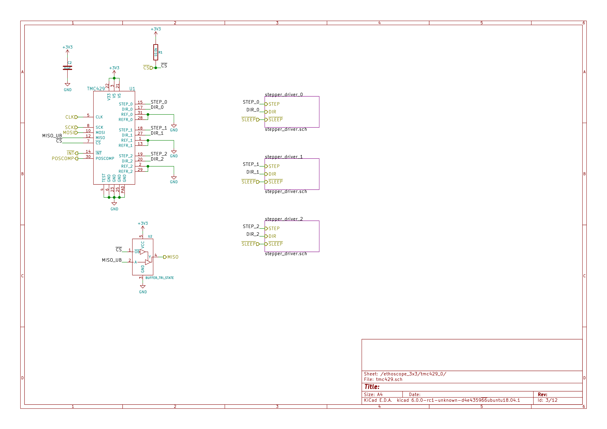
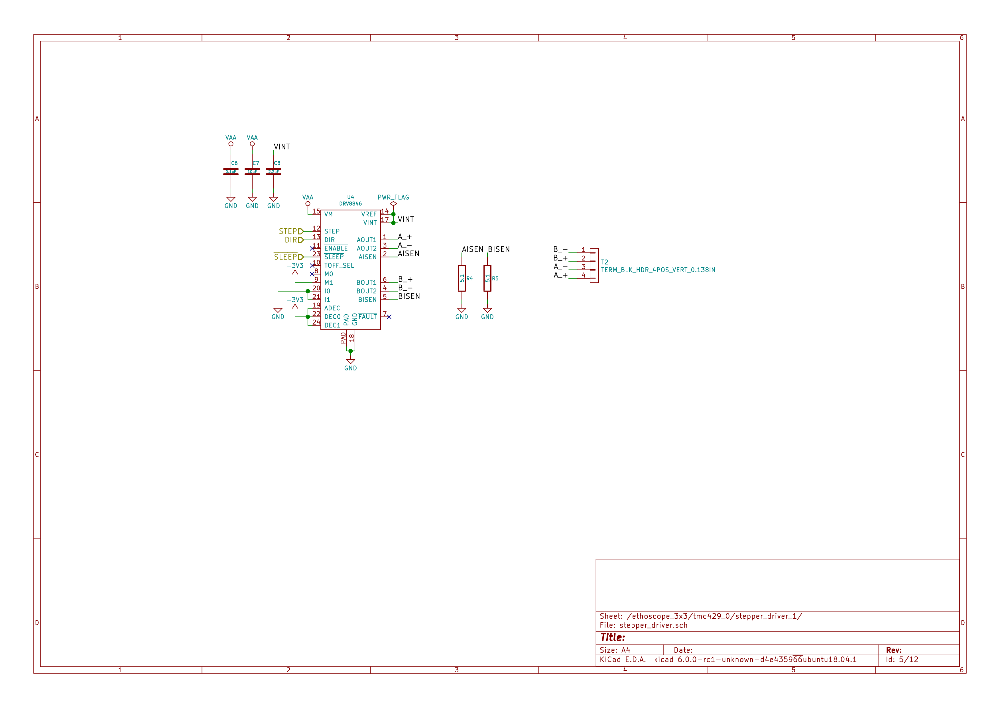
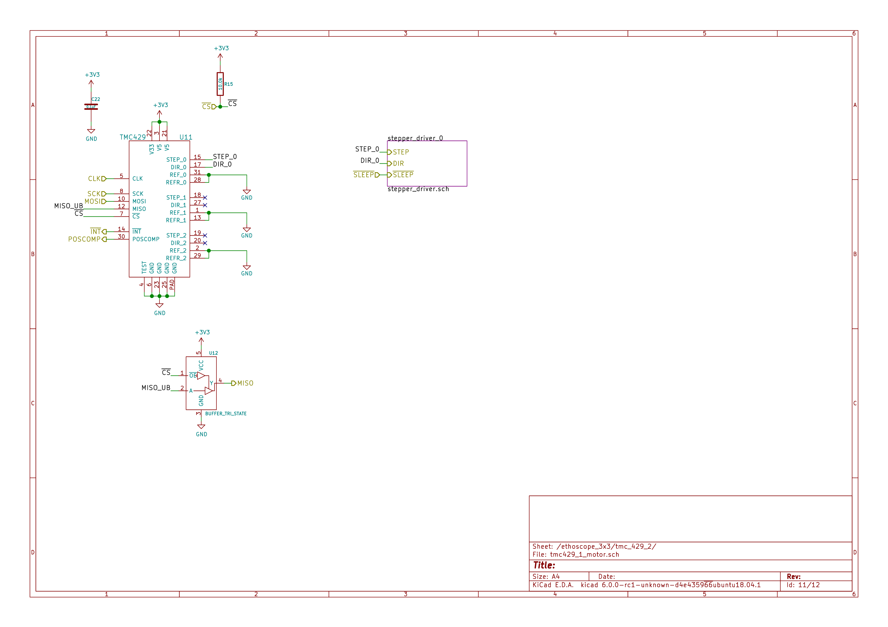
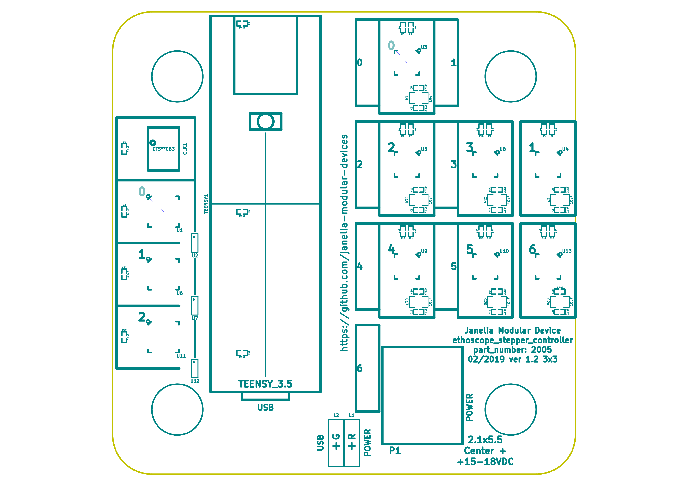
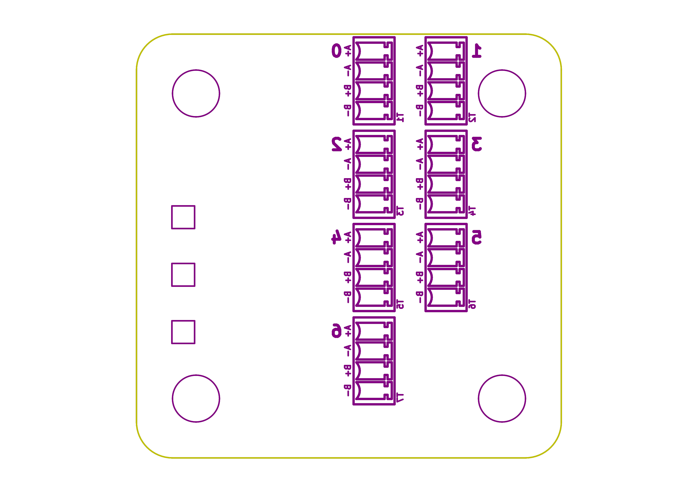

- [Repository Information](#orgfe8c0ad)
  - [Description](#org835b7ae)
- [Images](#orgb3ac2a3)
- [Schematic](#orgc04fbb4)
- [Gerbers](#orgf4d3cf5)
- [Bill of Materials](#orgdffa3b2)
  - [PCB Parts](#org689a3a4)
  - [Supplemental Parts](#org6ad8ffb)
  - [Vendor Parts Lists](#orgcbe00a5)
- [Supplemental Documentation](#org37ef636)
  - [Assembly Instructions](#org069a54f)

# Repository Information

-   **Name:** ethoscope\_stepper\_controller\_3x3
-   **Version:** 1.1
-   **License:** Open-Source Hardware
-   **URL:** <https://github.com/janelia-kicad/ethoscope_stepper_controller_3x3>
-   **Author:** Peter Polidoro
-   **Email:** peterpolidoro@gmail.com

## Description

This device controls the 7 stepper motors on the fly ethoscope rig.

# Images

# Schematic

[./schematic/ethoscope\_stepper\_controller\_3x3.pdf](./schematic/ethoscope_stepper_controller_3x3.pdf)

# Gerbers

Send gerbers zip file to your favorite PCB manufacturer for fabrication.

[./gerbers/ethoscope\_stepper\_controller\_3x3\_v1.1.zip](./gerbers/ethoscope_stepper_controller_3x3_v1.1.zip)

# Bill of Materials

## PCB Parts

| Item | Reference(s)                                     | Quantity | PartNumber       | Vendor  | Description                      |
|---- |------------------------------------------------ |-------- |---------------- |------- |-------------------------------- |
| 1    | C1 C12 C13 C16 C19 C2 C22 C23 C3 C6 C9           | 11       | 1276-1739-1-ND   | digikey | CAP CER 0.1UF 25V Y5V 0402       |
| 2    | C10 C14 C17 C20 C24 C4 C7                        | 7        | 445-14419-1-ND   | digikey | CAP CER 10UF 35V X5R 0805        |
| 3    | C11 C15 C18 C21 C25 C5 C8                        | 7        | 445-9028-1-ND    | digikey | CAP CER 2.2UF 35V X5R 0402       |
| 4    | CLK1                                             | 1        | CTX277LVCT-ND    | digikey | OSC XO 32.000MHZ HCMOS TTL SMD   |
| 5    | L1                                               | 1        | 350-1723-ND      | digikey | LED 2MM 24V VERTICAL RED PC MNT  |
| 6    | L2                                               | 1        | 350-1726-ND      | digikey | LED 2MM 5V VERTICAL GREEN PC MNT |
| 7    | MH1 MH2 MH3 MH4                                  | 4        | 36-2441-ND       | digikey | SHLDR SCREW RND HEAD HEX 4-40    |
| 8    | P1                                               | 1        | CP-015AHPJ-CT-ND | digikey | CONN PWR JACK 2X5.5MM SOLDER     |
| 9    | R1 R15 R8                                        | 3        | P10KJCT-ND       | digikey | RES SMD 10K OHM 5% 1/10W 0402    |
| 10   | R10 R11 R12 R13 R14 R16 R17 R2 R3 R4 R5 R6 R7 R9 | 14       | 408-1454-1-ND    | digikey | RES SMD 5.1 OHM 1% 1/6W 0402     |
| 11   | T1 T2 T3 T4 T5 T6 T7                             | 7        | 277-5738-ND      | digikey | TERM BLOCK HDR 4POS VERT 3.5MM   |
| 12   | TEENSY1                                          | 1        | 1568-1464-ND     | digikey | TEENSY 3.5 (HEADERS)             |
| 13   | U1 U11 U6                                        | 3        | 1460-1071-1-ND   | digikey | IC MOTOR CONTROLLER SPI 32QFN    |
| 14   | U10 U13 U3 U4 U5 U8 U9                           | 7        | 296-40083-1-ND   | digikey | IC MOTOR DRIVER PAR 24VQFN       |
| 15   | U12 U2 U7                                        | 3        | 296-11603-1-ND   | digikey | IC BUF NON-INVERT 5.5V SOT23-5   |

## Supplemental Parts

| Item | Quantity | PartNumber   | Vendor  | Description                      |
|---- |-------- |------------ |------- |-------------------------------- |
| 1    | 1        | 102-4531-ND  | digikey | AC-DC 18 VDC 2 A SW C14 DESK     |
| 2    | 1        | 1175-1298-ND | digikey | CORD PWR MALE-FEMALE STR 2M      |
| 3    | 1        | 1175-1694-ND | digikey | CABLE USB-A TO MICRO USB-B .5M   |
| 4    | 2        | 1212-1209-ND | digikey | SOCKET 7 MM SOLDER TAIL SINGLE   |
| 5    | 28       | 277-2433-ND  | digikey | FERRULES WITH PLASTIC SLEEVE YEL |
| 6    | 7        | 277-2418-ND  | digikey | TERM BLOCK PLUG 4POS STR 3.5MM   |
| 7    | 7        | P14333-ND    | digikey | STEP MOTOR PM GEARED BIPOLAR 15V |

## Vendor Parts Lists

[./bom/digikey\_parts.csv](./bom/digikey_parts.csv)

[./bom/supplemental\_digikey\_parts.csv](./bom/supplemental_digikey_parts.csv)

# Supplemental Documentation

## Assembly Instructions

-   Solder surface mount and through hole components onto the pcb.
